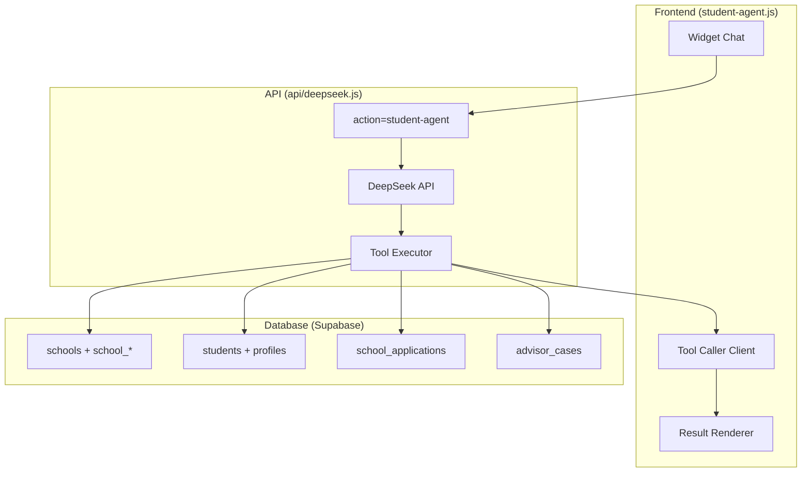
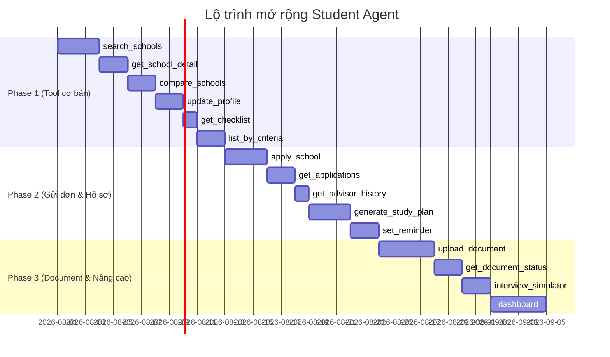

# Kế hoạch mở rộng Trợ lý cá nhân (Student Agent)

> **Mục tiêu:** Biến trợ lý AI từ "chatbot đơn thuần" thành "Agent có thể thao tác toàn bộ dữ liệu của học sinh" — tra cứu, sửa, tạo, xoá thông tin qua chat.

---

## 🧠 Hiện trạng

### Agent hiện tại có thể
- ✅ Chat với AI dựa trên context profile học sinh
- ✅ Sửa profile (GPA, trường, ngành...) qua `updatedProfile`
- ✅ Cập nhật checklist qua `updatedChecklist`
- ✅ Lưu lịch sử chat (localStorage, 20 messages gần nhất)

### Agent hiện tại KHÔNG thể
- ❌ Tra cứu trường từ database thật (chỉ qua AI nhớ)
- ❌ So sánh trường
- ❌ Gửi đơn đăng ký
- ❌ Tạo/dời nhắc nhở
- ❌ Upload file
- ❌ Xem tiến độ visa
- ❌ Thao tác dữ liệu trên server (Supabase)

---

## 📦 Kiến trúc mục tiêu



**Luồng xử lý (Intent → Action → Response):**

```
Học sinh: "Gửi đơn cho tôi vào trường Osan"
→ Agent nhận message
→ DeepSeek phân tích ý định: { tool: "apply_school", params: { school: "Osan" } }
→ Tool Executor gọi API: POST /api/auth/student?action=save-application
→ DB insert → Response: "✅ Đã gửi đơn thành công!"
```

---

## 🗺️ ROADMAP

### Phase 1: Tool-calling cơ bản 🔵 (Ưu tiên cao nhất)

| # | Tool | Mô tả | API dùng | Khó |
|:-:|:-----|:------|:---------|:---:|
| 1 | `search_schools` | Tìm trường theo tên/khu vực/hệ | `/api/schools` | 🟢 |
| 2 | `get_school_detail` | Xem chi tiết 1 trường (học phí, KTX, điều kiện) | `/api/schools?slug=...` | 🟢 |
| 3 | `compare_schools` | So sánh 2+ trường | `/api/schools?ids=...` | 🟢 |
| 4 | `update_profile` | Sửa thông tin cá nhân | `auth/student?action=save-checklist` | 🟢 |
| 5 | `get_checklist` | Xem checklist + tiến độ | localStorage / server | 🟢 |
| 6 | `list_by_criteria` | Lọc trường (region, cost, system) | `/api/schools` | 🟢 |

**Cách triển khai Phase 1:**

```javascript
// Trong handleStudentAgent (api/deepseek.js):
// 1. Gửi message + system prompt có danh sách tool
// 2. DeepSeek trả về JSON: { tool: "search_schools", params: { query: "Osan" } }
// 3. Backend thực thi tool, lấy data từ DB
// 4. Trả kết quả về client

// System prompt bổ sung:
const TOOL_LIST = `
Bạn có thể dùng các công cụ sau:
1. search_schools(query) — Tìm trường theo tên
2. get_school_detail(slug) — Xem chi tiết trường
3. compare_schools(slug1, slug2) — So sánh 2 trường
...
Trả về JSON: { "tool": "tên_tool", "params": {...} }
Nếu không cần tool, trả lời bình thường.
`;
```

---

### Phase 2: Gửi đơn & Hồ sơ 🟡 (Sau Phase 1)

| # | Tool | Mô tả | API dùng | Khó |
|:-:|:-----|:------|:---------|:---:|
| 7 | `apply_school` | Gửi đơn đăng ký vào trường | `auth/student?action=save-application` | 🟡 |
| 8 | `get_applications` | Xem danh sách đơn đã gửi + trạng thái | `auth/student?action=get-applications` | 🟡 |
| 9 | `get_advisor_history` | Xem lịch sử tư vấn AI | `advisor_cases` table | 🟡 |
| 10 | `generate_study_plan` | Soạn Study Plan + preview | `deepseek?action=generate-checklist` | 🟡 |
| 11 | `set_reminder` | Tạo nhắc nhở hạn giấy tờ | localStorage / server | 🟡 |

**Lưu ý Phase 2:** Cần thêm endpoint mới hoặc mở rộng endpoint hiện tại.

---

### Phase 3: Document & Tracking 🔴 (Phase cuối)

| # | Tool | Mô tả | API dùng | Khó |
|:-:|:-----|:------|:---------|:---:|
| 12 | `upload_document` | Upload file giấy tờ | `student_documents` table | 🔴 |
| 13 | `get_document_status` | Xem trạng thái từng giấy tờ | storage bucket | 🔴 |
| 14 | `check_deadlines` | Xem hạn nộp giấy tờ sắp tới | server-side calc | 🔴 |
| 15 | `interview_simulator` | Luyện phỏng vấn KVAC | `extra_interviews` table | 🟡 |
| 16 | `dashboard` | Tổng quan hồ sơ (progress, risk, tasks) | tổng hợp nhiều table | 🔴 |

---

## 📐 Chi tiết kỹ thuật

### A. Cấu trúc Tool Definition

```javascript
// api/deepseek.js — danh sách tool
const TOOLS = [
  {
    name: 'search_schools',
    description: 'Tìm kiếm trường Hàn Quốc theo tên hoặc từ khoá',
    params: { query: 'string (required)', region: 'string (optional)', limit: 'number (optional, default 5)' },
    handler: async (params) => {
      const { data } = await supabase.from('schools')
        .select('id, name, name_kr, slug, region, system, tuition')
        .ilike('name', `%${params.query}%`)
        .limit(params.limit || 5);
      return data;
    }
  },
  {
    name: 'compare_schools',
    description: 'So sánh 2 trường',
    params: { slug1: 'string (required)', slug2: 'string (required)' },
    handler: async (params) => {
      const { data } = await supabase.from('schools')
        .select('*, school_conditions(*), school_majors(*), school_advantages(*)')
        .in('slug', [params.slug1, params.slug2]);
      return data;
    }
  },
  // ... thêm tool dần
];
```

### B. Luồng xử lý mới

```
POST /api/deepseek?action=student-agent
{
  message: "Tìm trường ở Gyeonggi học phí rẻ",
  studentProfile: { ... },
  conversation: [ ... ]
}

→ DeepSeek phân tích → xác định dùng tool "search_schools"
→ Backend thực thi:
    1. Gọi supabase.from('schools').select(...).eq('region', 'gyeonggi')
    2. Format kết quả
    3. Trả về: { reply: "...danh sách trường...", toolResults: [...] }

→ Frontend render kết quả dạng card nếu có toolResults
```

### C. Frontend: Render kết quả Tool

```javascript
// student-agent.js — render kết quả đặc biệt cho từng loại tool
function renderToolResult(tool, data) {
  switch (tool) {
    case 'search_schools':
      return renderSchoolCards(data);
    case 'compare_schools':
      return renderCompareTable(data);
    case 'get_checklist':
      return renderChecklistProgress(data);
    default:
      return ''; // fallback text
  }
}
```

---

## 📊 Ưu tiên triển khai



---

## 🧪 Test & Validation

### Phase 1 — Test tool calling
- [ ] `search_schools("Osan")` → trả về đúng trường Osan
- [ ] `search_schools("seoul", { region: "seoul" })` → chỉ trả về trường Seoul
- [ ] `get_school_detail("osan")` → đầy đủ học phí, KTX, điều kiện
- [ ] `compare_schools("osan", "induk")` → bảng so sánh
- [ ] `update_profile({ gpa: 7.5 })` → localStorage + server đều cập nhật
- [ ] `get_checklist()` → trả về tiến độ chính xác

### Phase 2 — Test transaction
- [ ] `apply_school("osan")` → tạo application trong DB + không duplicate
- [ ] `get_applications()` → danh sách đơn + trạng thái
- [ ] `set_reminder("Nộp sổ TK", "2026-09-15")` → reminder xuất hiện đúng hạn

---

## 📝 Ghi chú

- **Bảo mật:** Học sinh chỉ được thao tác trên DỮ LIỆU CỦA CHÍNH MÌNH. Tool calling cần kiểm tra `student_id` khớp với token xác thực.
- **Rate limit:** Tránh tool calling quá nhiều → giới hạn 5 tool calls / 1 message.
- **Fallback:** Nếu DeepSeek không parse được ý định → trả lời chat bình thường.
- **Chi phí:** Tool calling giảm số token cần gửi lên AI vì không cần nhồi data vào prompt.

---

*Cập nhật: Tháng 8/2026*
